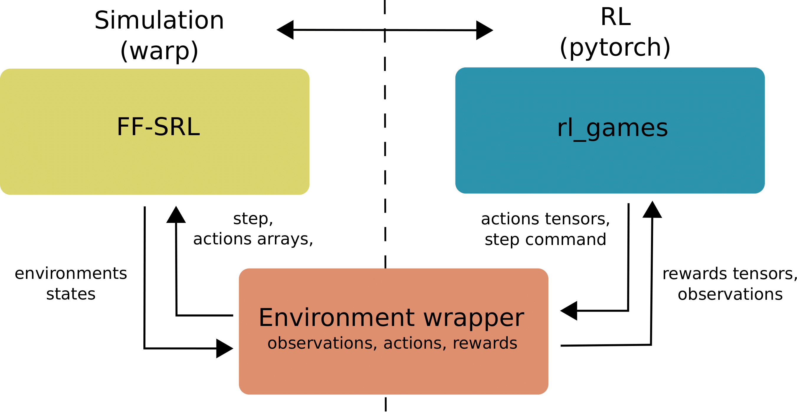

# FF-SRL: High Performance GPU-Based Surgical Simulation For Robot Learning

This repository contains rhe implemenation of the project "FF-SRL: High Performance GPU-Based Surgical Simulation For Robot Learning"

In this paper, we presented FF-SRL, a GPU-based simulation environment for robotic surgery that leverages an
advanced XPBD simulation of deformable tissue. We showed that FF-SRL can significantly speed up the RL training
process for surgical tasks, achieving higher frame-rates and faster training time than other available simulators. We also
demonstrated the scalability and efficiency of our simulation environment, which can run on a single low-end GPU device.



## Abstract
Robotic surgery is a rapidly developing field that can greatly benefit from the automation of surgical tasks. However, training techniques such as Reinforcement Learning (RL) require a high number of task repetitions, which are especially unsafe and impractical to perform on real surgical systems. This
stresses the need for simulated surgical environments, which are not only realistic, but also computationally efficient and scalable. We introduce FF-SRL, a high-performance learning environment for robotic surgery. In FF-SRL both physics simulation and RL policy training reside entirely on a single
GPU. This avoids typical bottlenecks associated with data transfer between the CPU and GPU, leading to an accelerated learning rates. Our results show that FF-SRL reduces the training time of a complex tissue manipulation task by an order of magnitude, down to a couple of minutes, compared to a conventional CPU/GPU simulator. Such speed-up may facilitate the experimentation with RL techniques and contribute to the development of new generation of surgical systems. Hence, we make our code publicly available to the community.

## Content
 ###  <u> **The full code will be released after paper acceptance.** </u>

## Installation
```
git clone https://github.com/SanoScience/FF-SRL.git
conda create -n FF_SRL python=3.9
conda activate FF_SRL
cd FF-SRL
pip install -e .
```

## Examples


An example of liver simulation with a laparoscope can be accessed here:
```
cd FF-SRL/FF_SRL/FF_SRL/tests/
python testLiverRetraction.py
```
In order to move the laparoscope use:
* j to move left
* l to move right
* i to move away (z axis)
* k to move closer (z axis)
* u to move up
* o to move down
* f to clamp the instrument effector
* r to reset the environment

## Citing
**Paper submitted to iros 2024-still under review.**
